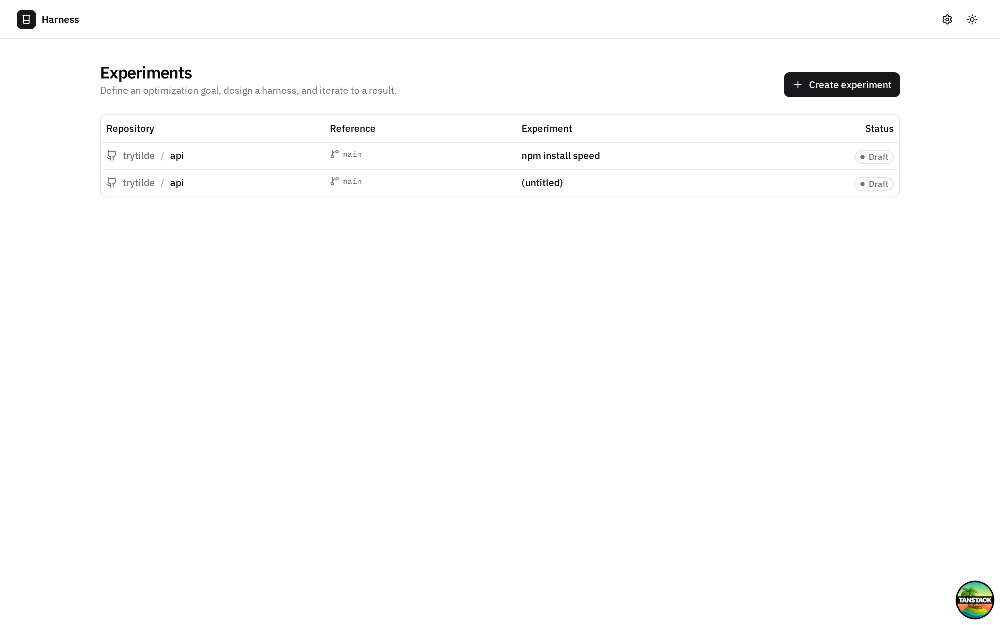
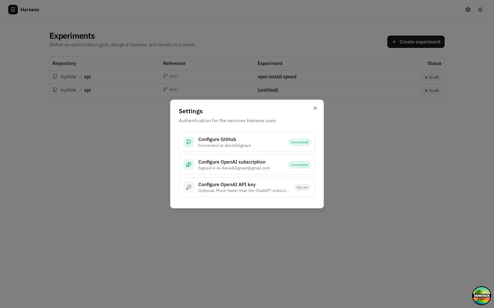
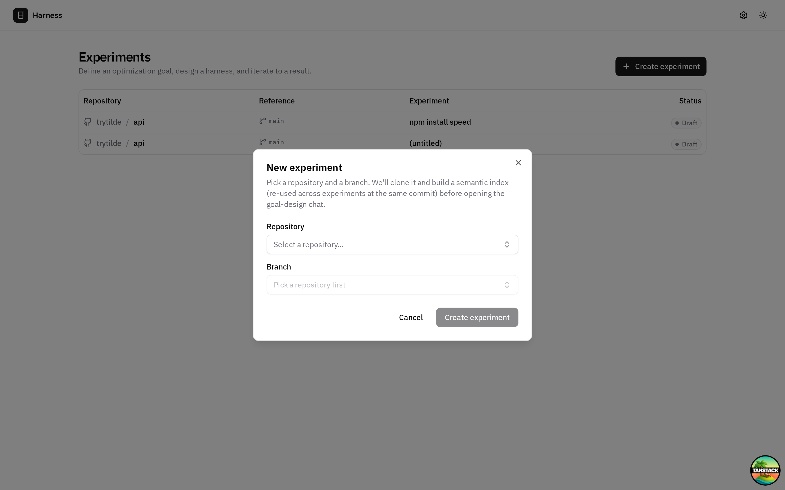
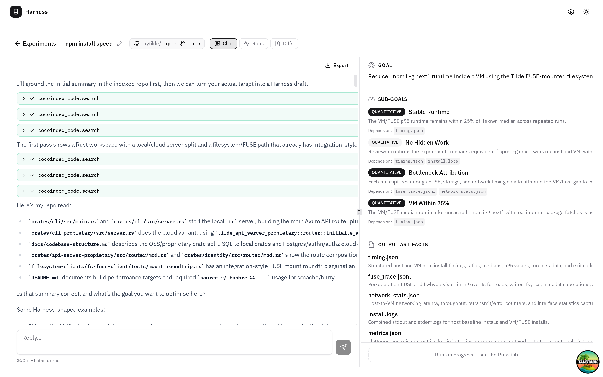
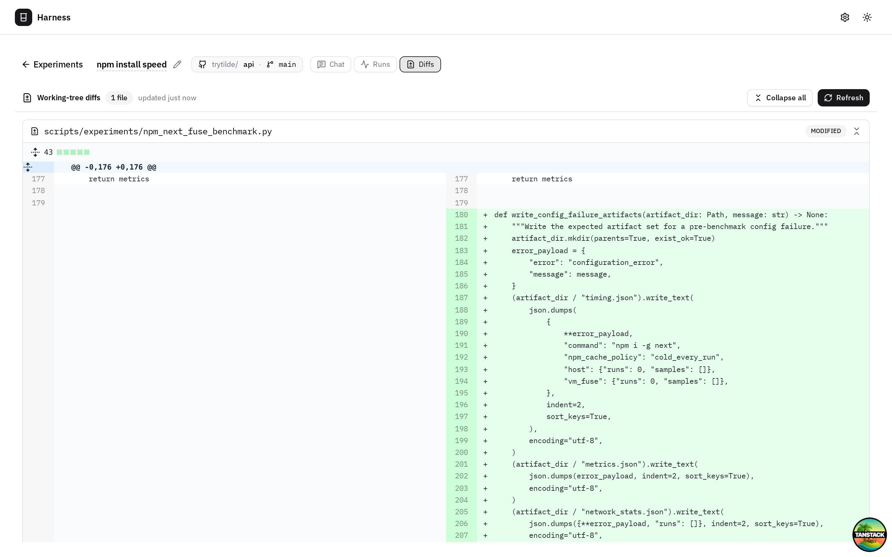
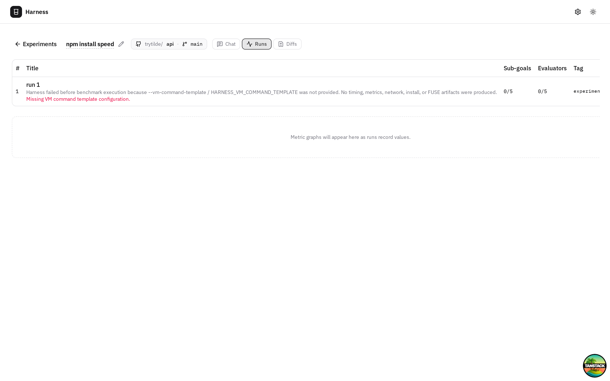

# harness-shop

> A workbench for **harnesses** — opinionated, agent-driven UIs that turn a
> repetitive engineering workflow into a structured, repeatable loop.
> Open-source, local-first, contribution-friendly.

`harness-shop` is intentionally a *collection*. Each harness lives in this
monorepo, shares the same shell (auth, indexing, agent plumbing,
persistence), and applies it to a specific kind of work. The first
harness in the shop is **Experiment Optimization** (described below); we
expect future ones to cover security review, dependency upgrades,
performance regression sweeps, and other repeatable engineering loops.

If you want to contribute a new harness, see [`AGENTS.md`](./AGENTS.md)
and the [`skills/`](./skills) directory for guidelines + reusable agent
skills.

---

## The first harness: Experiment Optimization

Turns a vague engineering goal — *"make `npm i -g next` finish in under
9 s in our FUSE VM"* — into a runnable, measurable, agent-driven
experiment loop. It clones the target repo, indexes it semantically,
sits the Codex agent on top of the index, and walks you (with the
agent) through:

1. **Design** — agree on a one-sentence goal, 2–4 sub-goals (mix of
   quantitative + qualitative), the output artifacts each run produces,
   and the metrics worth graphing.
2. **Harness implementation** — the agent edits the cloned source to
   add a repeatable run script, the evaluator code/prompts, and any
   minimal instrumentation.
3. **Run loop** — the agent executes the harness, collects artifacts,
   metrics, and per-evaluator pass/fail; commits each run on a private
   branch (`experiment/<id>`) tagged `experiment/<id>/<runNum>`;
   reviews; adjusts; tries again. Aborts after a configurable number of
   consecutive failures.

The whole thing runs on your machine. The cloned repo's remote is
removed so the agent **cannot push**. Indexes, runs, metrics, and
evaluator outcomes all live in a single libsql / SQLite DB.

### Why

Optimisation work is repetitive: write a benchmark harness, capture
artifacts, parse them, decide what to change, repeat. Each iteration's
context is brittle and almost never reused for the next iteration.

This harness:

- **Persists every run** (artifacts, metrics, evaluator outcomes) so the
  agent can search prior runs and reason over multiple iterations rather
  than guess from short-term memory.
- **Grounds the agent in your code** via [cocoindex-code](https://github.com/cocoindex-io/cocoindex-code)
  — semantic search over the cloned repo via an MCP server.
- **Scopes blast radius** — workspace-write sandbox + remote stripped
  so experiments stay 100 % local until you decide otherwise.

### Screenshots

| Home dashboard | Settings · single-click connections |
|---|---|
|  |  |

| Create experiment from any GitHub repo | Live agent chat + structured side panel |
|---|---|
|  |  |

| Side-by-side diffs for harness changes | Per-run metrics with pass/fail dots |
|---|---|
|  |  |

---

## Setup

Single command:

```bash
git clone https://github.com/trytilde/harness-shop
cd harness-shop
make setup        # pnpm install + ripgrep + cocoindex-code (uv) + .env.local
make dev          # http://localhost:3100
```

`make setup` is idempotent: it installs Node deps, installs `ripgrep`
and `uv`, uses uv to install the [`cocoindex-code`](https://github.com/cocoindex-io/cocoindex-code) CLI, and writes
`.env.local` with a fresh `HARNESS_TOKEN_ENCRYPTION_KEY` (used to
encrypt OAuth tokens at rest in SQLite). Re-running it is safe — it
short-circuits anything already in place.

Override host/port for remote dev:

```bash
pnpm dev -- --host 0.0.0.0 --port 3000
```

### First-run wizard (per harness — only the first time)

1. Click the **gear** in the top-right → *Configure GitHub*. Walk
   through the OAuth-app instructions; paste client id + secret. Sign
   in. **Credentials are stored encrypted in `data/harness.db`, not in
   any env file.**
2. *Configure OpenAI subscription* — sign in with ChatGPT (Plus). The
   auth token is materialised into our own `data/codex-home/auth.json`
   so we don't touch your real `~/.codex`.
3. Optionally *Configure OpenAI API key* — falls back here if the JWT
   is throttled or rejected (e.g. for the `/v1/responses` agent
   endpoint, the JWT lacks `api.responses.write` scope; an API key is
   the path).
4. **Create experiment** → pick repo + branch. Harness clones it,
   indexes it (cocoindex daemon, OpenAI embeddings, ~couple of minutes
   for a fresh medium-sized repo), then drops you in the chat.

## Stack

| Layer | Choice |
|---|---|
| Web framework | [TanStack Start](https://tanstack.com/start/) (React + Vite SSR + server functions) |
| UI | shadcn/ui · Tailwind v4 · IBM Plex Sans/Mono · `react-resizable-panels` · `react-diff-viewer-continued` · `recharts` |
| Storage | SQLite via [libsql](https://github.com/tursodatabase/libsql-client-ts) + [Drizzle ORM](https://orm.drizzle.team/) |
| Agent | [`@openai/codex-sdk`](https://www.npmjs.com/package/@openai/codex-sdk) over the upstream `codex` CLI. ChatGPT Plus auth via the same OAuth flow as the codex CLI. |
| Tools | Codex agent ↔ MCP servers: `cocoindex_code` (semantic search) + a custom `experiment_state` server that owns the design/run-state writes |
| Indexing | [`cocoindex-code`](https://github.com/cocoindex-io/cocoindex-code) (per-repo SQLite index, OpenAI embeddings via your JWT or API key) |

## Project layout

```
src/
  components/                  # UI: top bar, dialogs, experiment shell
    experiment/
      chat-panel.tsx           # Markdown chat + tool-call cards + export
      draft-panel.tsx          # Right sidebar: goal, sub-goals, metrics, …
      runs-tab.tsx             # Runs table + recharts metric graphs
      diffs-tab.tsx            # Full-page side-by-side diffs
  lib/                         # Shared types, client hooks
    use-experiment-chat.ts     # SSE streaming + history replay + cancel
  routes/_app/                 # TanStack Router file-based routes
    experiments/$experimentId.tsx
  routes/api/                  # SSE + REST server routes
    experiments.$experimentId.chat.ts
    experiments.$experimentId.chat.cancel.ts
    index-stream.$jobId.ts
  server/
    db/                        # libsql + Drizzle schema + migrations
    api/                       # Server functions (queryable from the client)
    agent/codex-runner.ts      # Codex SDK orchestration + system prompt
    chat/                      # Active-stream registry + persistence
    indexing/                  # simple-git clone, cocoindex daemon glue
    oauth/                     # GitHub OAuth App + ChatGPT PKCE
  mcp-servers/
    experiment-state.mjs       # Stdio MCP server — agent's writes to draft + runs
```

## Architecture cheat-sheet

```
┌─────────── Browser ───────────┐
│  TanStack Router + React      │
│  - useExperimentChat (SSE)    │
│  - DraftPanel · RunsTab        │
└───────────┬───────────────────┘
            │ SSE / fetch
┌───────────▼─── TanStack Start (Vite SSR) ─────────────┐
│  /api/experiments/$id/chat   POST = start a turn      │
│                              GET  = attach to live    │
│  /api/experiments/$id/chat/cancel  POST = abort       │
│  Server functions (Drizzle ⇆ libsql)                  │
│  Codex runner: spawns codex exec with                 │
│   - mcp_servers.cocoindex_code (ccc mcp, cwd=clone)   │
│   - mcp_servers.experiment_state (Node, our DB)       │
└───────────┬───────────────────┬───────────────────────┘
            │                   │
            │ stdio MCP         │ stdio MCP
            │                   │
   ┌────────▼─────────┐   ┌─────▼──────────┐
   │  cocoindex-code  │   │ experiment_    │
   │  (semantic       │   │ state.mjs       │
   │   search,        │   │ (writes goal,   │
   │   per-repo       │   │  sub-goals,     │
   │   SQLite index)  │   │  artifacts,     │
   └──────────────────┘   │  metrics, runs) │
                          └─────────────────┘
                          Same data/harness.db as the app.
```

The Codex agent is the only thing writing structured experiment state —
the UI only reads. That keeps state derivation in one place.

## Privacy & safety defaults

- **Single source of truth for credentials is `data/harness.db`,
  AES-256-GCM encrypted.** No env file holds an OAuth secret or API
  key. `make setup` generates the encryption key into `.env.local` if
  it doesn't exist; everything else is a UI step.
- The clone path is `data/repos/<org>/<name>/<sha>/`. Its `origin`
  remote is **removed** immediately after clone. Codex's sandbox is
  `workspace-write` with `.git` explicitly added to the writable roots
  so the agent can branch, commit, and tag locally — but no
  `git push` is possible without a remote.
- Nothing under `data/` is git-tracked. Check `.gitignore` if you're
  not sure.

## Adding a new harness to the shop

The shop is a monorepo of harnesses sharing one shell. To add a new
one (e.g. `harness-security-review`):

1. Define the harness's "phase machine" — what does *design* look like
   here? what does the *run loop* look like?
2. Reuse the existing primitives: `experiments` row + phase column,
   `chat_messages` for transcript, the `experiment_state` MCP server
   pattern, the SSE chat route. Most of the platform is already there.
3. Add harness-specific MCP tools next to `experiment-state.mjs`.
4. Wire its UI under `src/routes/_app/<harness-name>/...`.
5. Write an `AGENTS.md`-flavoured skill in `skills/<harness-name>/SKILL.md`
   explaining the contract.

We expect harnesses to be small and opinionated. If a harness can't fit
in one route + a few server functions + one MCP server, it's probably
trying to do two things.

## Contributing

See [`AGENTS.md`](./AGENTS.md) for the agent/contributor guide and
[`skills/`](./skills) for reusable agent skills shipped with the
project. Tests live next to the code (vitest is wired but the suite is
small; PRs welcome).

## License

Apache-2.0.
